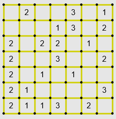
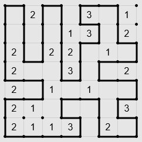
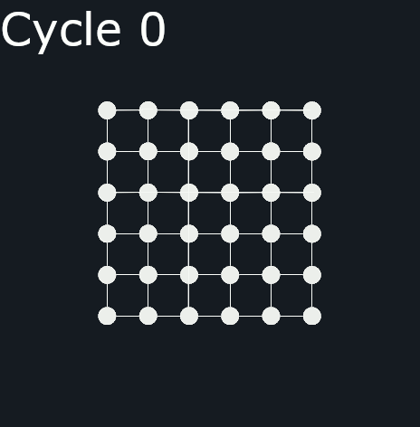

# Slitherlink

# Français

Ce programme permet de générer une grille vierge et génère une courbe aléatoire à plusieurs segments de slitherlink.
Il a été créé dans le cadre de l'évènement "Maths En Jean 2020-2021" pour mon lycée. Il n'y aura malheureusement pas de publication officielle à cause de la pandémie actuelle. 

## <ins>Introduction au Slitherlink</ins> :

Le Slitherlink (ou loppy en Français) est un jeu de réflexion solitaire. Le but du jeu est de former une courbe fermée dans une grille comportant des nombres dans des cases indiquant le nombre de côtés où la courbe passe. 

Non résolue                         | Résolue 
:----------------------------------:|:-------------------------------:
 | 

Il y a cependant quelques règles à respecter : 

* La courbe ne doit pas se croiser (ce qui veut dire qu'il n’y a pas de chiffres supérieurs à 3)
* La courbe doit toucher les 4 bords de la grille
* La grille doit être unique (qu'elle a qu'une solution)

## <ins>Objectif</ins> :

L'objectif qui nous avait été donné était de générer une grille de slitherlink, nous avons malheureusement fait que la moitié du problème car nous n'avions pas eu le temps de finir la génération des chiffres dans la grille suite à des problèmes comme le COVID-19 qui nous a compliqué énormément la tâche avec le temps. 
 

*Remarque* : Je ne continuerai pas ce programme pour le finir, dû à mon manque de temps et surtout que j'ai fais ça avec mes camarades de mon club. Vous pouvez tout de même vous en inspirer ou le reprendre pour le finir.

## <ins>Explication</ins> :  

L'algorithme ici présent permet de générer une courbe aléatoire. Il y a une [première version](https://github.com/naliliV2/Slitherlink/tree/1.0) qui a été abandonnée car elle présentait de nombreux bugs. 

Notre algorithme est une sorte de ``"mineur"``, je m'explique :
En premier lieu, il faut prendre une grille totalement vierge et pleine avec aucun nombre a l'interieur, puis retirer petit à petit des carrés aléatoirement mais avec certaines règles. Après avoir “miner” un certain nombre de carré, on trace un trait entre les carrés non miner et ceux miner, nous obtenons bien une courbe.

 

**Exemple en image**  

 

  

Comme il y a été dit ci-dessus, nous ne pouvons pas miner n'importe quel carré. Nous avons donc trouvé 3 règles algorithmique pour former une courbe correcte. A chaque fois qu'on prend un carré, nous devons re-appliquer les 3 règles dans l'ordre. Nous avons :

* L’accès au « vide » : Un carré peut être miné si il a accès à l'extérieur de la grille soit directement soit via d'autre carré miné.

* Aux alentours : Prenons les 8 carrés alentours du carré qu’on veut tester :

    * Si tous les carrés mangés sont collés tous les un contre les autres, alors il est possible de miner ce carré.

    * Dans le cas inverse, il est impossible de miner ce carré.

    * *Exception* : Si le carré qu’on veut tester est sur le bord de la grille, on créé une colonne et une ligne dites "fantome". Elles n'existent pas réellement mais on fait comme si elles existent et tous les carrés dans cette ligne et cette colonne sont déjà minés.  

* Maximum : Nous ne pouvons pas prendre un carré si la colonne ou la ligne est déjà tout miné sauf 1 carré restant, cela séparera la grille en 2 (*ce qui équivaut à 2 courbe*) ou que la courbe ne touche pas les quatres bordures de la grille. 

## <ins>Information</ins> :

* main.py : Programme principal.
* console.py : Permet de faire les commandes pour lancer le programme. 
* draw.py : Gère l'interface graphique.
* mine.py : Mine un carré qui peut être pris aléatoirement. 
* check_rule.py : Permet de défénir quel carré peut être miné avec certaine règle. 
* parameter.py : paramètre la turtle (librairie python). 

 

## <ins>Information supplémentaire</ins> :  

Nous avons commencé un algorithme pour générer les chiffres, le but était de faire des paternes de 3 par 3 déjà préfait (avec les chiffres et des morceaux de courbe) qu'on collera sur la grille. Le problème est que cette méthode est peut-être instactivement fiable (mais nous ne pouvons pas démontrer que c'est fiable), mais très long à mettre en place car il faut traité un par un les possibilitées combien de chiffre minimum pouvons nous mettre dans ce paterne, il y a probablement plusieurs **millions** de cas à traiter. 

Dans le dossier ``abandonned files`` il y a :

* Un programme qui fait la génération tous les morceaux de grilles possibles grâce à de  la récursivité 

* un autre programme juste pour rajouter des chiffres. 

Je n'expliquerai pas leurs fonctionnements car ils ne sont pas utiles pour l'algorithme final mais ils étaient là juste pour nous aidés à notre tâche ainsi qu'ils sont très dur à prendre en main sans une explication rigoureuse. 

## <ins>FAQ</ins> : 

> Question : Ai-je le droit d'utilisé pour des fins personnels ?

Réponse : Bien-sûr ! C'est le principe d'Open source. 

> J'ai une erreur quand je lance le programme, que dois-je faire ?

Dans ce genre de situation, merci de créé un issue et j'essayerai de voir le problème avec vous.

> Pourquoi le github est en 3.0 alors que la release est en 2.0 ?

Car la 3.0 est surtout une version d'organisation suur github, il y a effectivement quelques petites nuances dans les fichiers mais tellement minime que vous ne verrez pas la différence en tant qu'utilisateur. 

# EN : 
Not yet translated. In the futur, I translate every file and the explication of this.
